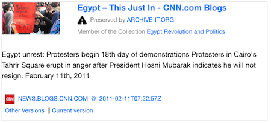

MementoEmbed: Archive-Aware Web Page Surrogates
===============================================

.. image:: images/thumbnail-example.png

MementoEmbed generates surrogates for archived web pages, known as mementos. A surrogate in this case is a representation of a page, like a social card or a web page screenshot seen above. In addition to creating the surrogate, MementoEmbed also provides the user with HTML so that they can embed the surrogate into their web page or blog.

MementoEmbed differs from other surrogate generation tools in a number of ways. It focuses on mementos, so it is archive-aware. This means that it can separate the information about the archive (e.g., which archive it came from, when it was captured, the locations of other captures) from information about the resource that it is archiving (e.g., CNN.COM or WWW.CALEIDA.PT). This distinction allows a user to understand the nature of the web page behind the surrogate.

Guide
-----

.. toctree::
   :maxdepth: 2

   user_interface
   web_api
   license

