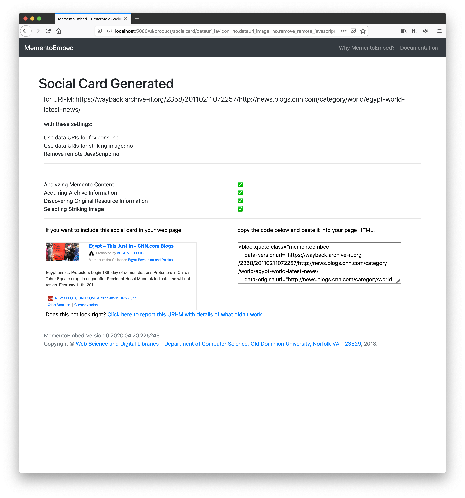

==============
User Interface
==============

MementoEmbed's user interface provides a simple environment for users to request surrogates for use in their web page or blog.

.. image:: images/MementoEmbed-front-page.png

The front page provides a brief explanation along with a text box in which the user can enter their memento URI (URI-M).

The user can also choose which type of surrogate they wish to generate, either social card or thumbnail.

If social card, the user is presented with a social card and the a textarea on the right containing the HTML they can copy and paste into their web page or blog.

