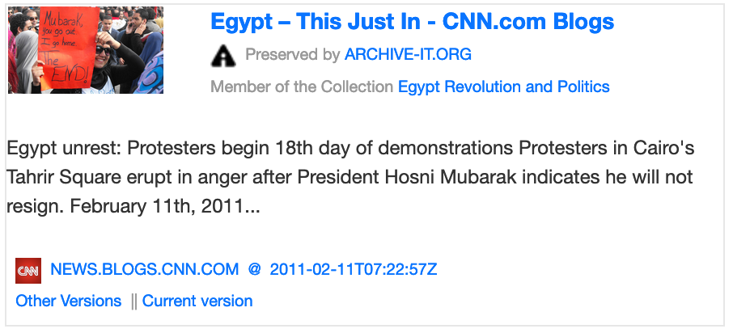
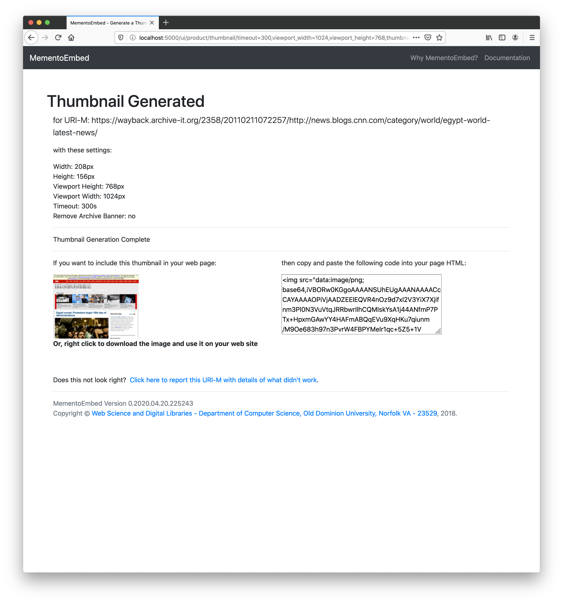
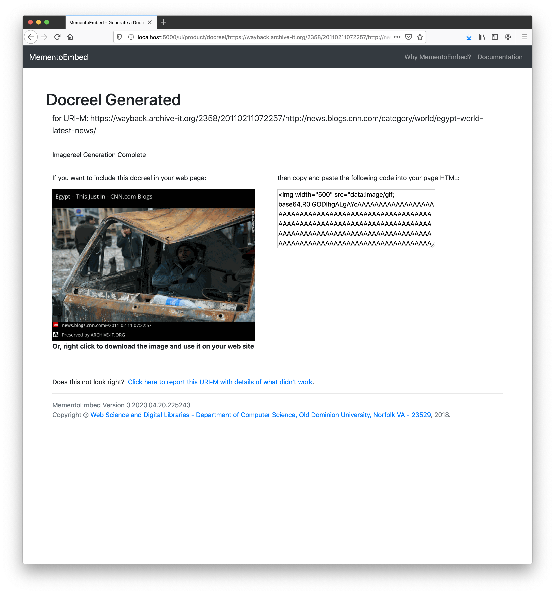

==============
User Interface
==============

MementoEmbed's user interface provides a simple environment for users to request surrogates for use in their web page or blog.

The front page provides a brief explanation along with a text box in which the user can enter their memento URI (URI-M).

The user can also choose which type of surrogate they wish to generate, either social card, thumbnail, or imagereel.

If the user chooses social card, the user is presented with a social card and the a textarea on the right containing the HTML they can copy and paste into their web page or blog.

.. image:: images/social-card-ui-example.png
   :align: center

Below is a screenshot of this social card.

If the user chooses thumbnail, the user is presented with a browser thumbnail in the textarea on the right containing the HTML they can copy and paste into their web page or blog. The user may also download the thumbnail for future use.

This is the thumbnail from the above screenshot.

If the user chooses imagereel, the user is presented with an animated GIF of the top 5 images from the page, along with HTML they can copy and paste into their web page or blog. The user may also download the imagereel for future use.

This is the imagereel from the above screenshot.

If the user chooses Word Cloud, MementoEmbed will generate a word cloud of the most frequent terms from the page.

This is the word cloud from the above screenshot.

MementoEmbed also supports an experimental surrogate we call the docreel. Docreels take a while to generate depending on the size of the page and the number of images.

Docreels are an animated GIF of the top 5 images and the top 5 sentences from the page, along with HTML the author can copy and paste into their web page or blog. The user may also download the docreel for future use.

.. image:: images/docreel-example.gif